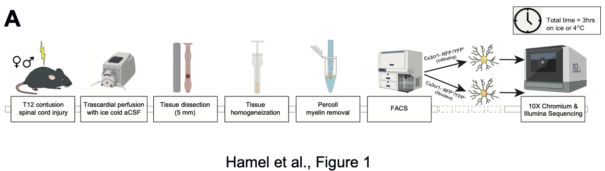

 
#### The spinal cord injury (SCI) myeloid cell atlas is a shiny web app-based resource that can be used to interactively browse and download the data from: 
#### <a href="link here when availableXX" target="_blank"> Hamel R, <i>et al</i>. Time-resolved single-cell RNAseq profiling identifies a novel Fabp5-expressing subpopulation of inflammatory myeloid cells in chronic spinal cord injury. <i>bioRxiv</i> XXXX (2020) - BioRxiv link will be here asap</a> 

 

 

#### Abstract
Innate immune responses following spinal cord injury (SCI) participate in early secondary pathogenesis and wound healing events. Here, we used time-resolved scRNAseq to map transcriptional profiles of SC tissue-resident and infiltrating myeloid cells post-SCI.

Our work identifies a novel subpopulation of Fabp5+ inflammatory myeloid cells, comprising both resident and infiltrating cells and displaying a delayed cytotoxic profile at the lesion epicentre, which may serve as a target for future therapeutics.

 

#### Experimental Design
Using the 10X Genomics Chromium platform, we single cell RNA-sequenced 30,958 myeloid cells from female and male mice at 1, 2, 3, 10, and 21 days post contusion SCI injury. We used laminectomy only mice as controls. The data was collected from the Cx3cr1^CreERT (Cx3) mouse model, which labels all myeloid lineage cells with YFP, and from the Cx3cr1^CreERT x tdTomato (Cremato) mouse, which labels resident myeloid cells as RFP^+ YFP^+, and infiltrating myeloid cells as RFP^- YFP^+ .

  
 

 

#### Links
- The data is also available at GEO <a href="link hereXX" target="_blank"> GSE-XXX </a>
- <a href="https://github.com/regan-hamel/SCI_2020" target="_blank"> regan-hamel Github</a> containing all the scripts for the website, analyses, and figures
- <a href="https://github.com/MarioniLab/" target="_blank"> Marioni Github </a> for many of the packages used in the low level processing of this dataset
- <a href="https://www.pluchinolab.org/" target="_blank"> Pluchino Lab </a>
- <a href="https://www.ebi.ac.uk/research/marioni" target="_blank"> Marioni Lab </a>

 

#### Contact
Please contact Regan Hamel (rh680-at-cam.ac.uk) with any web atlas-related queries or suggestions.

